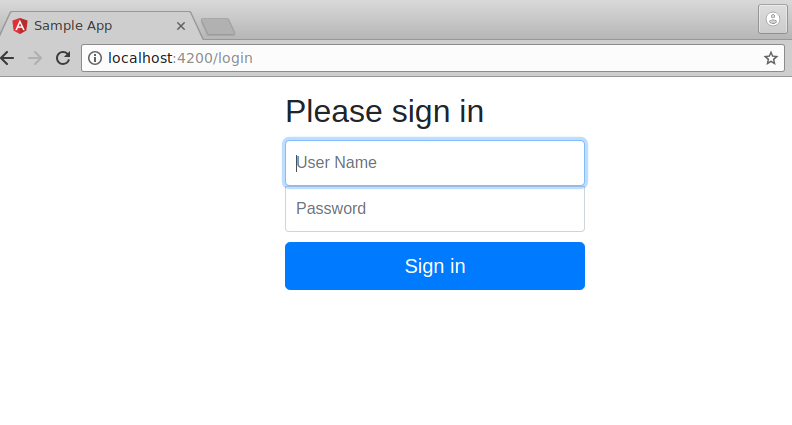
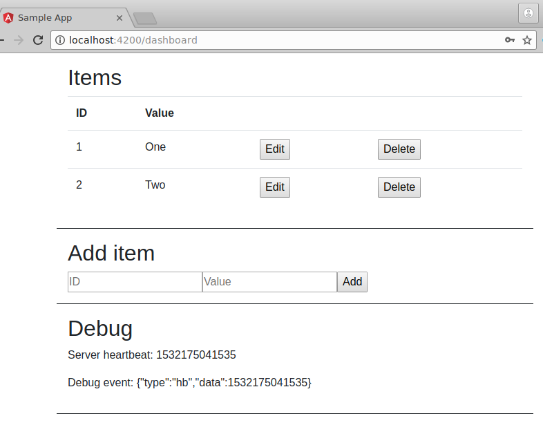

Angular socket.io CRUD sample
==========

Sample app using Angular 6 front-end and a simple node.js back-end over socket.io to perform CRUD in real-time.

Features / Technicalities
----------

- Client side: Angular.io 6
- All client-server communication over socket.io, so everything is real time, no REST calls.
- Server side: simply a socket.io data server using node.js standard HTTP server. No responsible for GUI at all so even Express is not needed.
- Basic login authentication using `socket.io-auth`.
- One-way data-binding (command-event pattern).
- Multiple clients can connect and see data change in real time.

Other considerations to be implemented
----------

- Reconnection - now if server is disconnected while in dashboard page and you perform action, then it simply redirects back to login page. Instead on disconnect it should try reconnect in the background, 
- Authentication 
  - Now it is only comparing against a config value in plain which is of course not safe.
  - Related to reconnection, authentication should get a token which can be refreshed.
- Persistence - the "Items" data are simply an in-memory array for now which are gone on restart. To include persistence in the server can be simply adding calls to a SQL db on data event publish, and on startup recover the data by doing a SQL select all.
- Convert to Event Sourcing storage - server now only stores current snapshot, so cannot do "time travel" replay.
- Now data change events are broadcast to all clients. We may not want this depending on the intended use case. Can change to respond to single client only or using the "room" feature of socket.io for specific group of clients.

Screenshots
----------

How to run
----------

Assuming node.js v8.9+ and angular.io v6+ is in the PATH -

Server

Config values can be changed in `server/config.js`

    cd server
    npm install
    node server.js

Client

    cd client
    npm install
    ng serve

